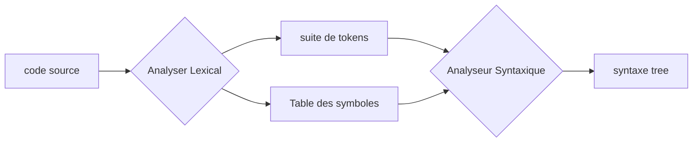
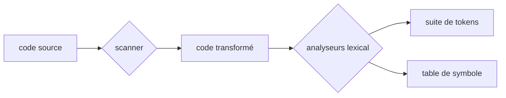
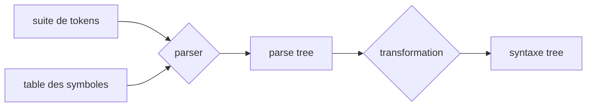

# Conception du compilateur

Conception du compilateur pour le PCL1

- code source : un programme 
- token : `<id,1>`,`<=>`,`<60>`,etc.
- AST : arbre des opérations

## 1. Analyseur lexicale :

L'analyseur lexicale se sépare en 2 parties :

### 1.1 Scanner

Le scanner enlève les commentaires, supprimes les  *blancs* consecutifs (saut de ligne, espace, tabulation)

### 1.2 Analyseur lexical

L'analyseurs lexical va générer les tokens pour le parser,
il doit renvoyer un token définit dans une table de token : 

Exemple de token : 

| token  | description      | exemple  | attribut                            |
| ------ | ---------------- | ------- | ----------------------------------- |
| if     | string "if"      | if      | None                                |
| number | \[0-9\]+         | 18, 120 | value                               |
| id     | any other string | var1    | type, @dans les Tables des symboles |

## 2. Analyse syntaxique

### 2.1 Erreur

L'analyseur syntaxique doit renvoyer les erreurs syntaxiques : 

- lexical : mal orthographier un keyword
- synctactic : pas refermer des parenthèses, des brackets, etc..
- logic : utilser = au lieu de := pour l'affectation

Il doit pouvoir renvoyer la ligne de l'erreur (communication avec la table de symbole ou l'analyseur lexicale).Cf p196-197 pour les descriptions de methode

### 2.2 Parser

Le parseur va utiliser les tokens pour générer le parse tree : la represention de toutes les dérivations obtenu par l'analyse descendante.

### 2.3 transformation

Il faut transformer le parse tree en syntax tree, supprimer toutes les dérivations inutiles et ne garder que les node importante (id, opération, etc.)
