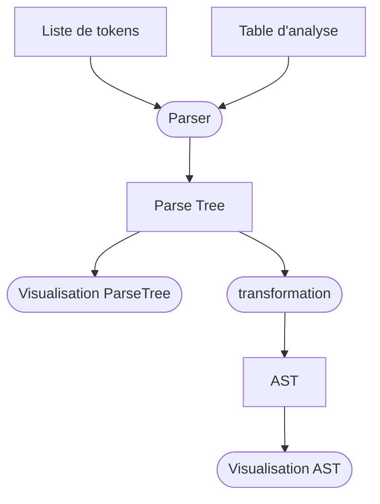
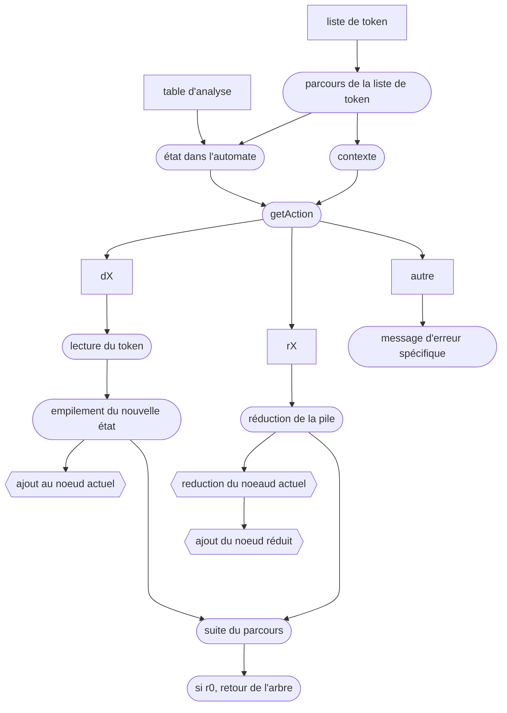
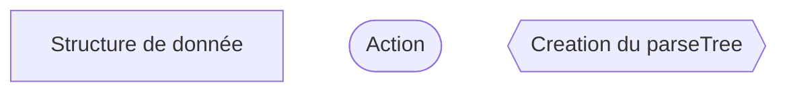
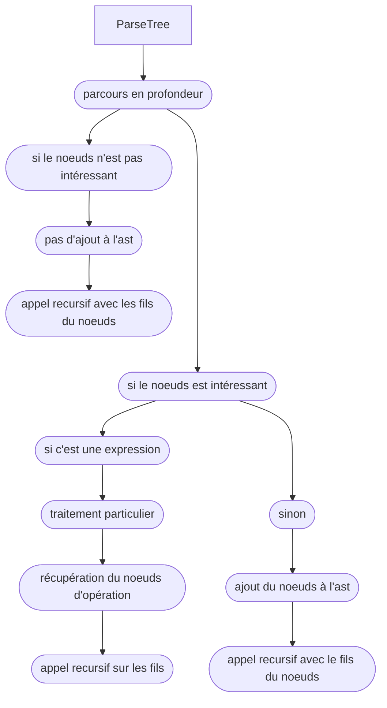

# Vue d'ensemble de l'analyse syntaxique

```mermaid
graph TD
A[Liste de tokens]
B[Table d'analyse]
C([Parser])
D[Parse Tree]
E([Visualisation ParseTree])
F([transformation])
G[AST]
H([Visualisation AST])
A-->C
B-->C
C-->D

D-->E
D-->F
F-->G
G-->H

```

## En détail :
### Le Parser

```mermaid
graph TD
A[liste de token]
B[table d'analyse]
C([parcours de la liste de token])
D([état dans l'automate])
E([getAction])
F([contexte])
G[dX]
H[rX]
I[autre]
J([lecture du token])
K([empilement du nouvelle état])
L([suite du parcours])
M([réduction de la pile])
N([message d'erreur spécifique])
O([si r0, retour de l'arbre])

P{{ajout au noeud actuel}}
Q{{reduction du noeaud actuel}}
R{{ajout du noeud réduit}}

A-->C
B-->D
C-->D
C-->F
D-->E
F-->E

E-->G
E-->H
E-->I


G-->J
J-->K
K-->P
K----->L

H-->M
M-->Q
Q-->R
M----->L

I-->N

L-->O
```
#### Légende

```mermaid
graph TD
A[Structure de donnée]
B([Action])
C{{Creation du parseTree}}


```

### Transformation du parseTree en AST

```mermaid
graph TD
A[ParseTree]
B([parcours en profondeur])
C([si le noeuds est intéressant])
D([si le noeuds n'est pas intéressant])

A-->B
B-->D
E([pas d'ajout à l'ast])
F([appel recursif avec les fils du noeuds])
D-->E-->F


G([si c'est une expression])
H([sinon])

B----->C
C-->G
C--->H

I([traitement particulier])
J([ajout du noeuds à l'ast])
K([appel recursif avec le fils du noeuds])

G-->I
H-->J-->K

L([récupération du noeuds d'opération])
M([appel recursif sur les fils])
I-->L-->M
```
