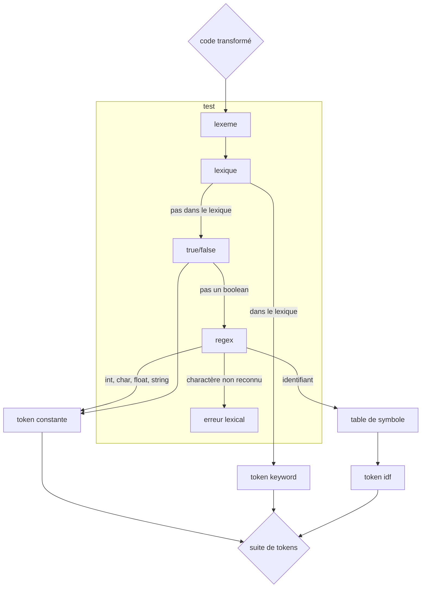

# Lexeur

```mermaid
flowchart TB
    i1{code transformé}
    i2[lexeme]
    i3[lexique]
    i4[true/false]
    i5[regex]
    i6{suite de tokens}
    i7[table de symbole]
    i8[token idf]
    i9[token keyword]
    i10[token constante]
    i11[erreur lexical]
i1-->i2
subgraph "test"
i2-->i3
i3--"pas dans le lexique"--->i4
i4--"pas un boolean"--->i5
i5--"charactère non reconnu"--->i11
end

i3--"dans le lexique"--->i9
i4-->i10
i5--"int, char, float, string"--->i10
i5--"identifiant"--->i7
i7-->i8

i8-->i6
i9-->i6
i10-->i6
```